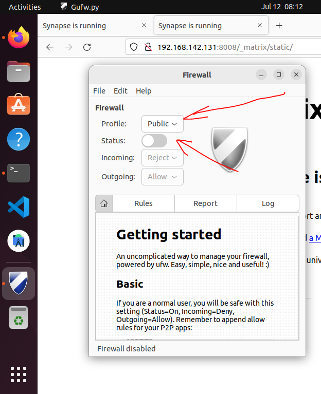

+++
title = "Testing"

weight = 10
template = "docs/page.html"

[extra]
toc = true
top = false
+++

## Unit Tests

### Rust

We are using [regular unit tests as by the Rust Book](https://doc.rust-lang.org/book/ch11-00-testing.html). You can run them with `cargo test` .

_Note_: For async unit test, we are using `tokio` so mark them with `#[tokio:test]` (rather than `#[test]`). Example:

```rust
use anyhow::Result;

#[tokio::test]
async fn testing_my_feature() -> Result<()> {
    // ... test code
    Ok(())
}
```

## Flutter

_Note_: We currently don't have proper widget tests. So this is mainly here for when we do have them available.

```
cd app
flutter test
```


## Integration Tests

### Infrastructure

You need a fresh [`synapse` matrix backend](https://matrix-org.github.io/synapse/latest/) with the following settings included (in the `homeserver.yaml`):

```yaml
allow_guest_access: true
enable_registration_without_verification: true
enable_registration: true
registration_shared_secret: "randomly_generated_string"

rc_message:
  per_second: 1000
  burst_count: 1000

rc_registration:
  per_second: 1000
  burst_count: 1000

rc_login:
  address:
    per_second: 1000
    burst_count: 1000
```

and an `admin` account with the username `admin` and passwort `admin` (which you can create with `register_new_matrix_user -u admin -p admin -a -c $HOMESERVER_CONFIG_PATH $HOMESERVER_URL`). To avoid the change of server URL under VMWare, you can use NAT mode not Bridged mode as network.

Please change `bind_addresses` of `listeners` from `['::1', '127.0.0.1']` to `['0.0.0.0']` (in the `homeserver.yaml`), that means any address and allows remote connection (non-localhost).

#### Docker Container
We have a `docker` container image available with that setup already for you at `lightyear/effektio-synapse-ci:latest`. Easiest is to use `docker-compose up -d` to run it locally from the root directory. This will also create the necessary `admin` account.

#### Firewall

If you are running synapse on a virtual or remote machine, don't forget update the firewall rules to allow access to the ports. To turn off the public profile of a server firewall on a `Ubuntu` linux, you can use `gufw` and disable it like so:



#### Mock data
The integration tests expect a certain set of `mock` data. You can easily get this set up by running

`cargo run -p effektio-cli -- $HOMESERVER`

**Reset docker**
To start the docker-compose afresh:

1. stop the service with `docker-compose stop`
2. remove the data at `rm -rf .local`
3. start the service with `docker-compose up -d`

Don't forget to rerun the `mock data` generation again.

### Rust integration tests

To run the rust integration tests, you need a fresh integration testing infrastructure (see above) availabe at `$HOMESERVER`. Assuming you are running the docker-compose setup, this would be `http://localhost:8118` (which is the fallback default, so you don't have to put it into your environment). Then you can run the integration test with:

```bash
HOMESERVER=http://localhost:8118 cargo test -- --ignored
```

### Flutter UI integration tests

To run the rust integration tests, you need a fresh integration testing infrastructure (see above) availabe at `$HOMESERVER` and an Android Emulator up and running. Build the App and run the tests with:

```
cd app
flutter drive --driver=test_driver/integration_test.dart integration_test/*  --dart-define DEFAULT_EFFEKTIO_SERVER=$HOMESERVER
```